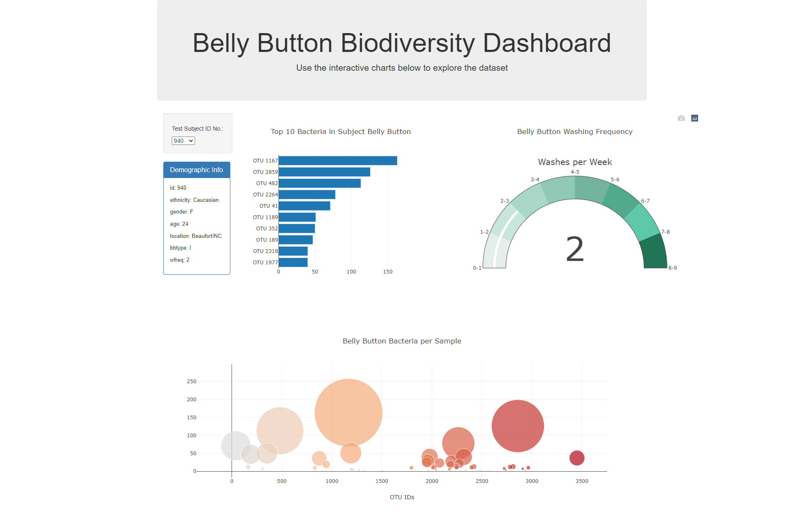

# belly-button-biodiversity-challenge

Using JavaScript, D3, and Plotly to create an interactive dashboard using data from the Belly Button Biodiversity dataset

3 charts were created: a horizonal bar chart, a bubble chart, and a gauge chart, with each chart updating based on the test subject ID chosen from the drop-down menu. 

